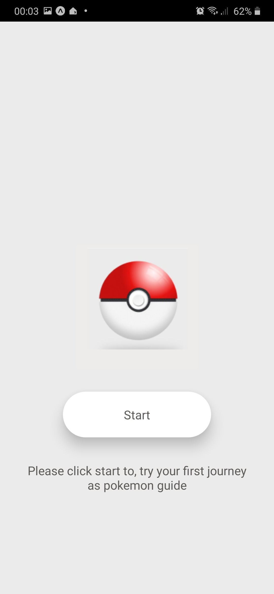

# Pokemon

A simple React Native application consume Pokeapi 
API: https://pokeapi.co/. 

# What's needed

- [Node.js](http://nodejs.org)
- [React](https://github.com/facebook/react) & [React Native](https://github.com/facebook/react-native)
- [Expo](https://docs.expo.io/)

## What's included

- axios and react-navigation

## Start

- Install node, expo-cli, and react-native-cli by following this [guide](https://reactnative.dev/docs/environment-setup)

After downloading source code in project root directory install below command:

$ npm i

## Develop

##### iOS

Run command to open iOS simulator and run app:

$ npm run ios

##### Android (6.0+)

Run command to open Android emulator and run app:

$ npm run android

##### Android (6.0+) (Using Expo)

Run command to start using expo

$ expo start

# Sample Simple Application

Image 1 (Home screen); 
Image 2 (Main screen); 
Image 3 and 4 (Detail Pokemon).  

       
      
      

